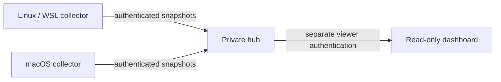

# Multiple devices, one private dashboard

Linux/WSL and macOS collectors keep local databases and push compact observations
to one hub. It groups registered repositories and separates runs by device and
installation. There are no agent controls, LAN scans, automatic pairing, public
deployment or Cloudflare integration. Cloud tasks remain local validated imports,
not live forwarded device observations.



## Existing private connectivity

Choose a topology only after approving the actual security/network setup:

- **Existing encrypted tunnel:** keep the hub on loopback; collectors use their
  own loopback endpoint of an independently configured SSH tunnel. That tunnel
  must carry the whole remote leg. The app never creates it.
- **LAN/Tailscale with direct TLS:** explicitly bind one private IPv4 address and
  supply approved certificates. Collectors verify hostname and CA.
- **Existing private TLS proxy:** keep the hub on loopback behind an approved
  private proxy, including an existing private Tailscale HTTPS endpoint. Preserve
  Host/Authorization headers and register the external hostname. Do not enable
  public sharing/Funnel for this local-only tool.

Tailscale documents encrypted peer traffic, but an address in `100.64.0.0/10`
alone does not prove the process is using it. HTTPS remains mandatory off
loopback; there is no insecure LAN/Tailscale flag. Plain HTTP accepts only literal
loopback IPs. Public/wildcard/reserved/link-local destinations are rejected.
HTTPS names must resolve entirely to private/loopback addresses; the chosen
address is pinned before sending credentials. No redirects, proxy-environment
or unverified-TLS fallback. Built-in listening supports explicit IPv4 only.
In WSL, the address must belong to WSL; a Windows-only interface may require an
existing approved tunnel/proxy. No networking changes were performed for this work.

## Register devices and hub

First approve token provisioning and secure distribution as a separate user step.
Each device needs a distinct random 32-byte token represented as 64 lowercase hex
characters. The browser viewer needs a different token. No production tokens or
TLS keys are supplied/generated here. Do not paste tokens into chat, commands,
URLs, Git, logs or screenshots.

After approved provisioning, each collector reads its token from a regular file
owned by its user, mode `0600`, containing only the token and optional newline.
Symlinks/broad permissions are rejected. The hub stores only
`sha256(token.encode("ascii"))`, never raw tokens. Calculate hashes with approved
local tooling that does not expose the original values.

Copy `examples/hub-registry.json` into a private candidate and replace its
deliberately invalid placeholders. Register each `machine` slug, `stream`
installation label (e.g. `install-1`), unique `token_sha256`, and repository
allowlist. Repository identity is `host/owner/repo`, never a credentialed URL or
checkout path. Local project aliases may differ; grouping uses repository
identity. `allowed_hosts` lists the IPs/names clients actually use, including
private proxy names. Device tokens cannot read the dashboard or impersonate
another device; the viewer token cannot ingest. Devices are trusted to report
their own allowed projects truthfully.

```sh
python3 /absolute/dashboard/scripts/setup.py hub-plan \
  --candidate /private/hub-candidate.json --registry /private/hub.json \
  --out /private/hub.setup-plan.json
# Review the concrete preview, then approve separately:
python3 /absolute/dashboard/scripts/setup.py apply \
  --plan /private/hub.setup-plan.json --approve REVIEWED_SHA
```

This previews registration, including removed devices; it does not pair them or
test connectivity. Rollback restores an untouched registry exactly and retains
later-edited registries with conflicts. Keep plans/receipts private. Restart the
hub to activate registration edits, token rotation and revocations.

Run with a **separate hub database** from local collector databases:

```sh
cd /absolute/dashboard
python3 -m zudo_agent --db /private/hub.sqlite3 hub --registry /private/hub.json
```

Default: `http://127.0.0.1:8765`. Browser login uses username **`viewer`** and the
separate viewer token in its authentication prompt, never in the URL. For an
approved direct private TLS listener:

```sh
# Example only: replace with the hub's approved private address.
python3 -m zudo_agent --db /private/hub.sqlite3 hub \
  --registry /private/hub.json --bind 192.168.1.20 \
  --tls-cert /private/hub-cert.pem --tls-key /private/hub-key.pem
```

The key must be a private regular file owned by the current user. Non-loopback
without TLS, wildcard and public binds are rejected. Ctrl-C stops this foreground
process; no service is installed. This is a small personal private-network tool,
not an Internet-facing multi-tenant service.

## Preview each collector

Run the skill/script **on that machine**, adding transport to normal local setup:

```sh
python3 /absolute/dashboard/scripts/setup.py plan \
  --project /absolute/my-project --project-id my-project \
  --repository github.com/example/my-project --machine my-laptop \
  --provider both --hub-url https://hub.example.ts.net:8765 \
  --stream install-1 --token-file /private/device.token \
  --out /private/collector.setup-plan.json
# Optional: --ca-file /private/approved-ca.pem
```

Preview stores only file references; it never reads/generates/sends the token,
contacts the hub or changes networks. Machine/stream/repository must match the
registry. Review and approve before applying. Transport applies to this machine's
shared config, so review every registered project before export. Omit transport
options for unchanged local-only mode. After approved setup:

```sh
cd /absolute/dashboard
python3 -m zudo_agent --config /private/collector-config.json \
  --db /private/collector.sqlite3 forward
```

Use the actual config/DB paths printed in the preview (defaults under
`$XDG_STATE_HOME/zudo-agent` or `~/.local/state/zudo-agent`). `forward --once` does
one attempt; `forward` repeats in the foreground. `serve` also forwards when its
config has `transport`, while showing a local UI. Hooks and collector share one
local config/DB. Synthetic verification stays in temporary storage, never sends
to the hub and never proves real hook delivery.

## Offline, restart and replay behavior

SQLite retains one pending snapshot plus an increasing sequence. Failed sends
retry unchanged, backing off 5–60 seconds while local collection continues.
After acknowledgment, the next frame contains current state. Restarts preserve
sequence with the same DB; do not use independent DBs for one machine/stream.

Exact retries are acknowledged without refreshing last-received time. Conflicting
duplicates, older frames and spoofed machine claims are rejected. Hub run IDs
are also namespaced by machine and stream. A lost/reset collector DB requires a
reviewed **new stream label** on both sides; never lower the hub watermark.
Old-stream packets cannot revive runs. Keep clocks synchronized: timestamps >60s
in the future are rejected; delayed data stays stale after arrival.

Devices start `unknown`, then show `online`, `stale` or `offline` from arrival and
sample age. Transport and lifecycle health remain separate. Last state remains
visible after disconnection with stale labels; turn-stop means idle and project
completion always stays unknown.

**The hub must stay online to receive observations and serve the dashboard.**
Collectors retain local history/pending frames while it is off. On recovery an
old frame may appear stale until the next current frame arrives. An open browser
marks cached observations stale on connection loss. Nothing monitors the world
while all machines are off.

## Privacy and limits

Frames contain registered repository identity, hashed run ID, machine/stream,
sequence, timestamps, enumerated source/state/presence and counts. No prompts,
transcripts, terminal contents, command arguments, cwd paths or session names.
Extra fields are rejected before storage. Event history stays local; the hub
keeps one current frame per device/stream. UI values render as text, not HTML.

Payloads are bounded to 256 KiB and at most 500 recent runs, with an explicit
omission count. Intermediate states may coalesce during outages; this is a
current-work monitor, not a lossless audit log. Requests/concurrency are bounded.
Old stream rows remain on disk until the owner removes the DB while stopped,
but are hidden after stream registration changes.

Linux/WSL reads `/proc/*/stat`; macOS reads libproc PID enumeration and
`PROC_PIDTBSDINFO` (PID, parent, process name, absolute start time), never argv.
Inaccessible/unrecognized processes remain uncertain. macOS native behavior is
checked in CI's self-process smoke test, not on any user's live Mac.

References: [Apple metadata](https://github.com/apple-oss-distributions/xnu/blob/main/bsd/sys/proc_info.h),
[libproc](https://github.com/apple-oss-distributions/xnu/blob/main/libsyscall/wrappers/libproc/libproc.h),
[Tailscale encryption](https://tailscale.com/security),
[Tailscale addresses](https://tailscale.com/docs/concepts/tailscale-ip-addresses).
